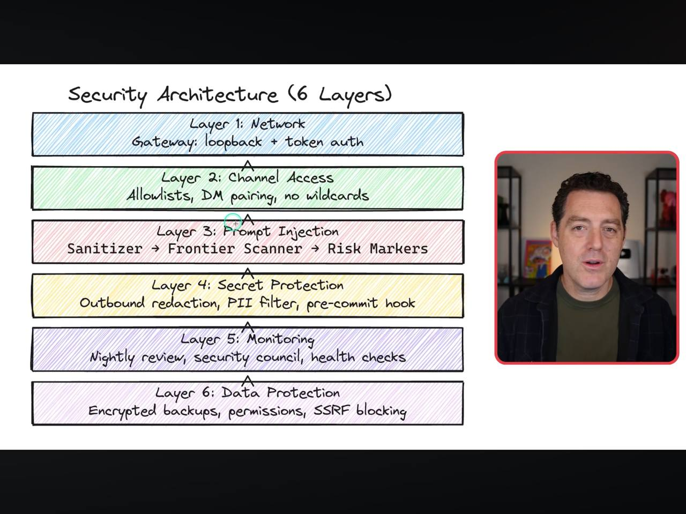
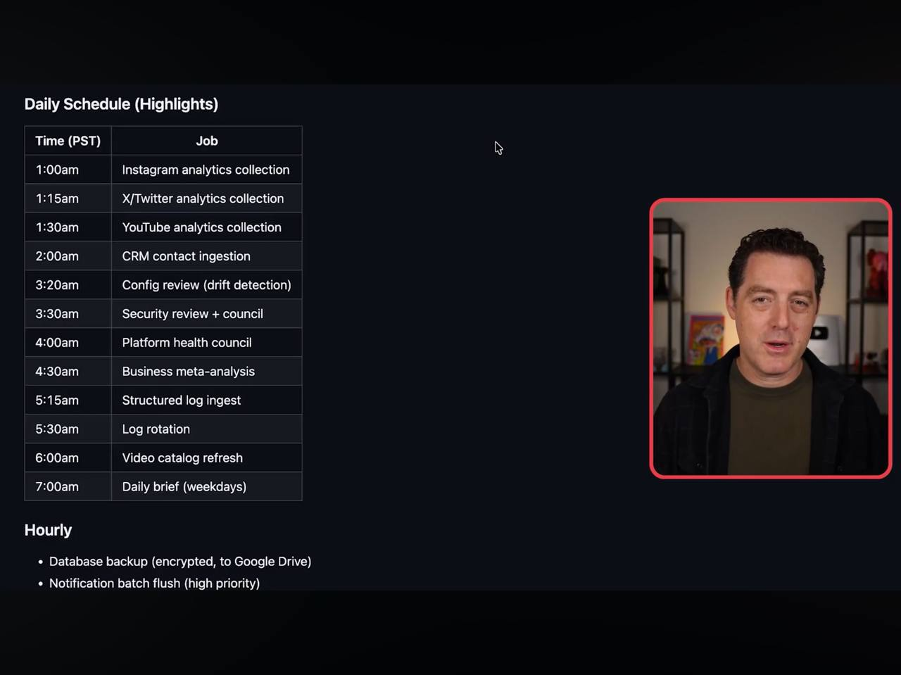
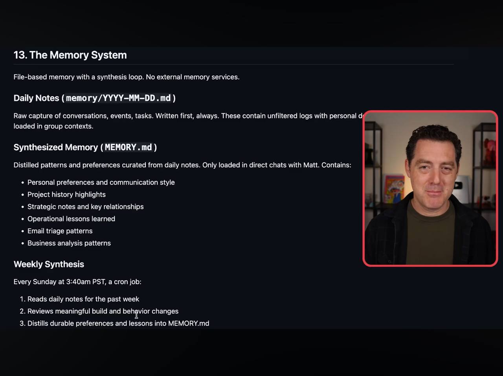
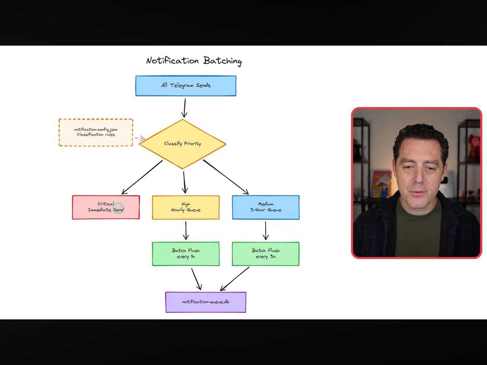
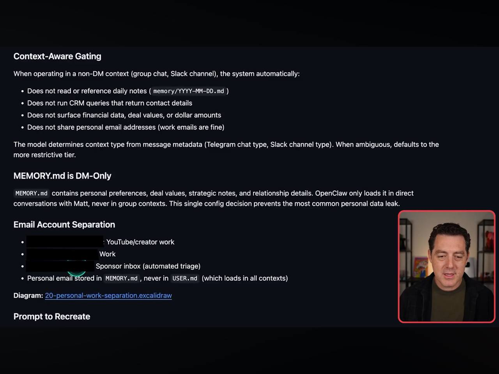
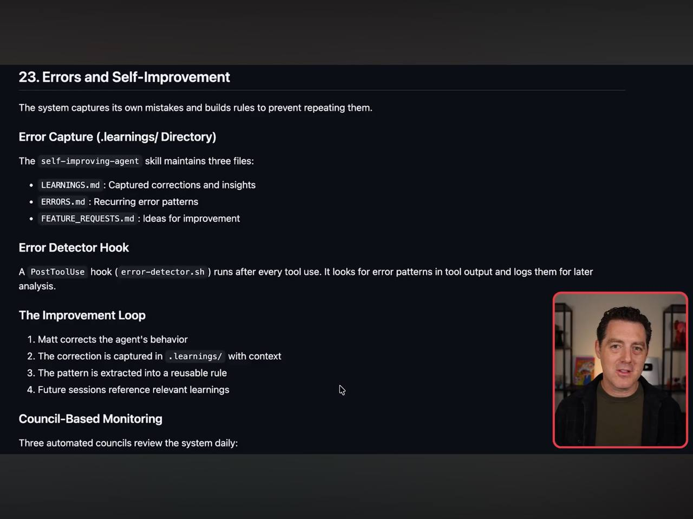

# Final Learnings: Matt Wolfe - Professional Agent Operations
**Source:** Matt Wolfe (Internal Build-out)
**Date:** 2026-02-26

## 1. Professional Maintenance & Reliability

### A. The Self-Improvement Loop
Wolfe implements a specific directory (`.learnings/`) and three files:
- `LEARNINGS.md`: Manual corrections from the user.
- `ERRORS.md`: Recurring error patterns detected by a PostToolUse hook.
- `FEATURE_REQUESTS.md`: Log of improvement ideas.
- **Improved by:** Three nightly "Councils" (Platform Health, Security, Innovation) that review logs and propose changes.

### B. Cron Job Standards
Over 30 daily jobs handle data collection.
- **Pattern:** Log Start -> Execute -> Log End -> Failure alerts to Telegram `#cron-updates`.
- **Reliability:** Uses a `cron-wrapper.sh` with PID locks and signal traps to prevent phantom processes.

### C. Backup & Recovery
- **Hourly DB Backups:** Auto-discovers `.sqlite` and `.jsonl` logs, encrypts them, and rotates (keeps 7).
- **Git Sync:** Hourly commits with merge conflict handling.
- **Integrity Drill:** Periodic "dry-runs" to ensure backups actually work before you need them.

## 2. Intelligence & Infrastructure

### A. Financial Tracking
- **Flow:** Export CSV (Account list + Transactions) -> Telegram financials topic -> Auto-import to SQLite.
- **Query:** Native support for "What was revenue last quarter?" and "Show open invoices."
- **Privacy:** Outbound redaction mask dollar amounts in non-financial channels.

### B. LLM Usage & Cost Dashboard
- **Interaction Store:** Centralized SQLite logging every prompt and response.
- **Estimator:** Real-time cost calculation per provider (Anthropic vs OpenAI).
- **Dashboard:** Generates weekly reports on which models are costing the most vs delivering value.

### C. Separation of Concerns (Personal vs Work)
Uses **Context-Aware Gating** to prevent leaks:
- DM Context: Access to personal emails, daily notes, financials.
- Group Context: Restricted to strategic notes and project tasks.
- Ambiguous Context: Reverts to more restrictive tier by default.

## Visual Documentation

## Alfred's Executive Summary
My favorite takeaway: **The Integrity Drill.** Most systems back up data but never prove they can restore it. I'll be adding an Integrity Drill to your weekly Heartbeat to ensure our S3/SSD backups are bulletproof.

---
#ai/enterprise #devops #observability #governance #cost-management
