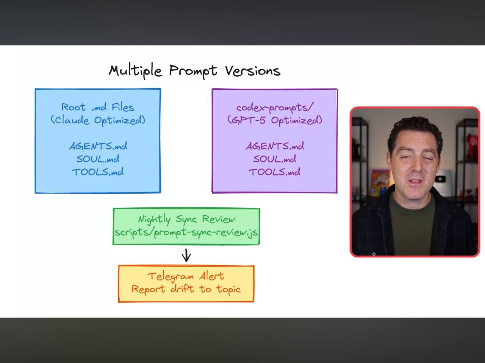
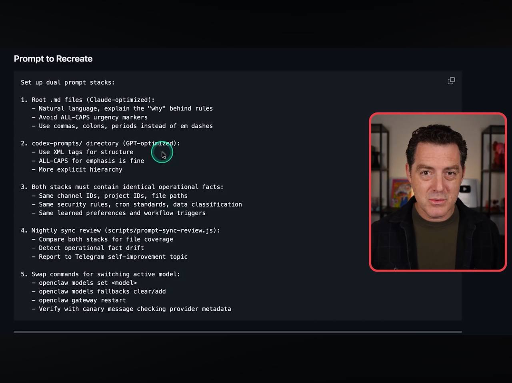
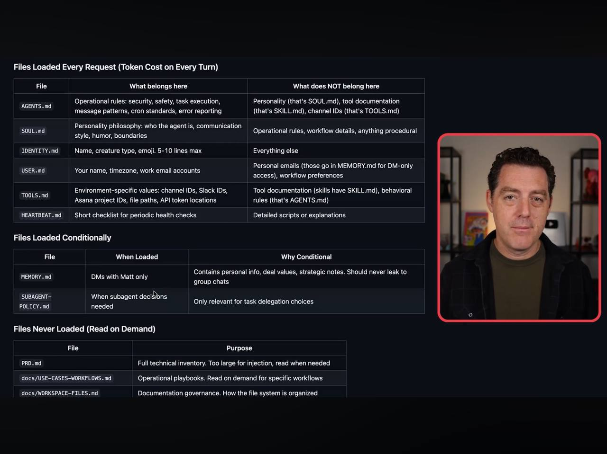
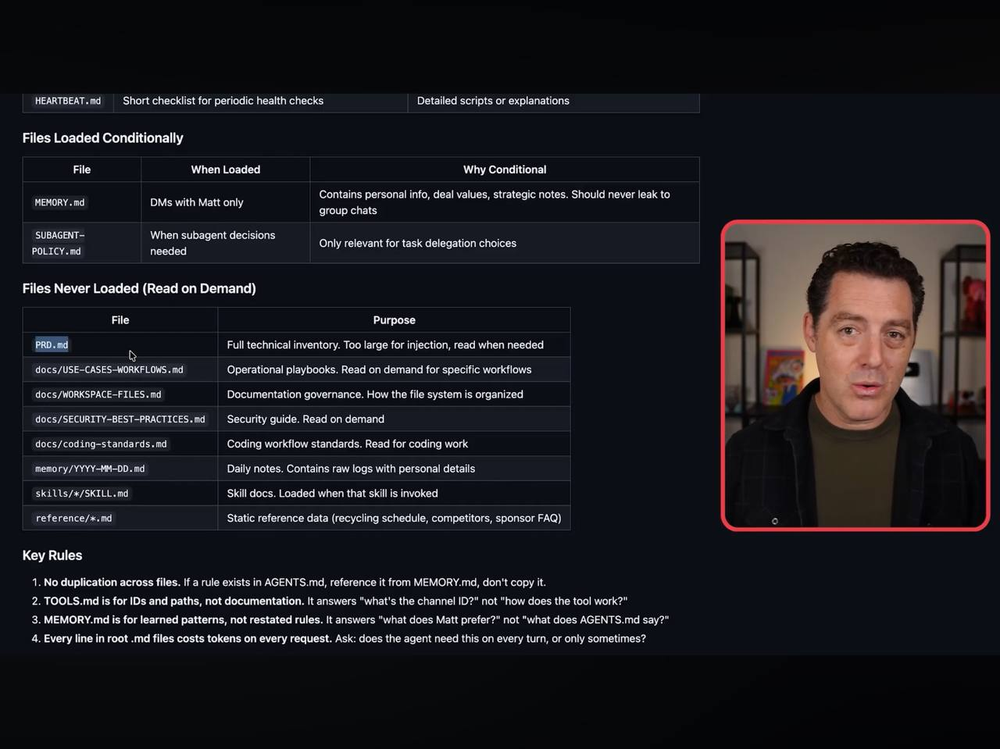
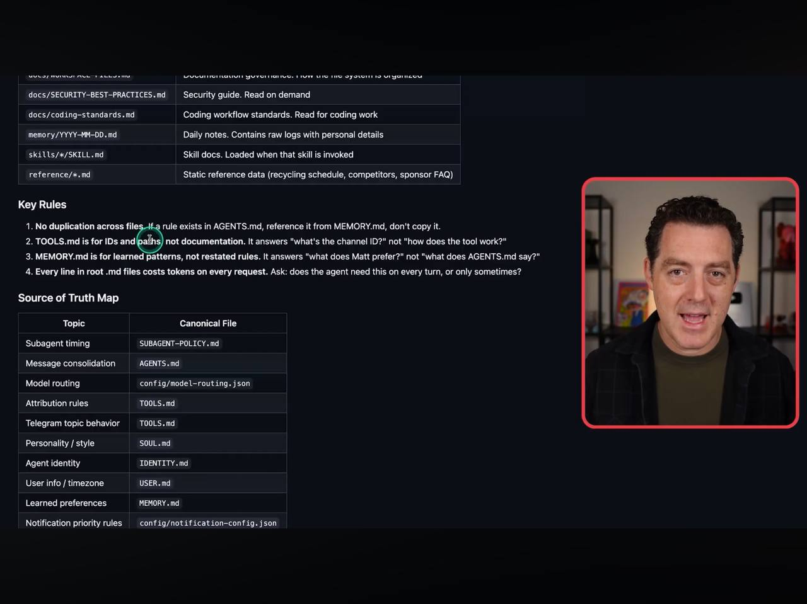

# Learnings: Matt Wolfe - Agent System Optimization
**Source:** Matt Wolfe (various snippets)
**Date:** 2026-02-26

## Core Concept: "Dual-Stack" Prompt Optimization
Different models (specifically Claude vs. GPT) respond better to different prompt structures. Wolfe suggests a "Dual-Stack" approach where operational files are tailored for the active model.

### 1. Model-Specific Style Rules
- **Claude (Root .md files):** 
    - Use natural language.
    - Explain the "why" behind rules.
    - Avoid ALL-CAPS urgency.
    - Use softer punctuation (commas/colons).
- **GPT (codex-prompts/ directory):** 
    - Use XML tags for structure.
    - ALL-CAPS for emphasis is positive.
    - Explicit, rigid hierarchy is better.

### 2. File Injection Hygiene (The "Token Budget")
A massive optimization strategy to keep token costs low and responses focused:
- **Always Injected:** `AGENTS.md` (Rules), `SOUL.md` (Vibe), `IDENTITY.md` (Emoji/Type), `USER.md` (Context), `TOOLS.md` (Paths/IDs).
- **Condition-Based:** `MEMORY.md` (only in DMs), `SUBAGENT-POLICY.md` (only for delegation).
- **Read Demand:** `PRD.md`, `USE-CASES-WORKFLOWS.md`, `Daily Notes`. These are searched via tool, never injected raw.

### 3. Key Rules for the System
- **No Duplication:** If a rule is in `AGENTS.md`, reference it elsewhere, don't copy it.
- **Strict Role for TOOLS.md:** Only for IDs and Paths, NOT documentation for how tools work.
- **Source of Truth Map:**
    - Personality -> `SOUL.md`
    - Logic/Safety -> `AGENTS.md`
    - Learned Preferences -> `MEMORY.md`

## Visual Documentation

## Alfred's "Aha!" Moment
Our current setup matches the "Always Injected" list (AGENTS/SOUL/USER), but we could optimize further by moving **Task Documentation** out of `AGENTS.md` and into "On Demand" files like `docs/WORKSPACE-FILES.md`.

---
#ai/prompt-engineering #optimization #architecture #agent-design
