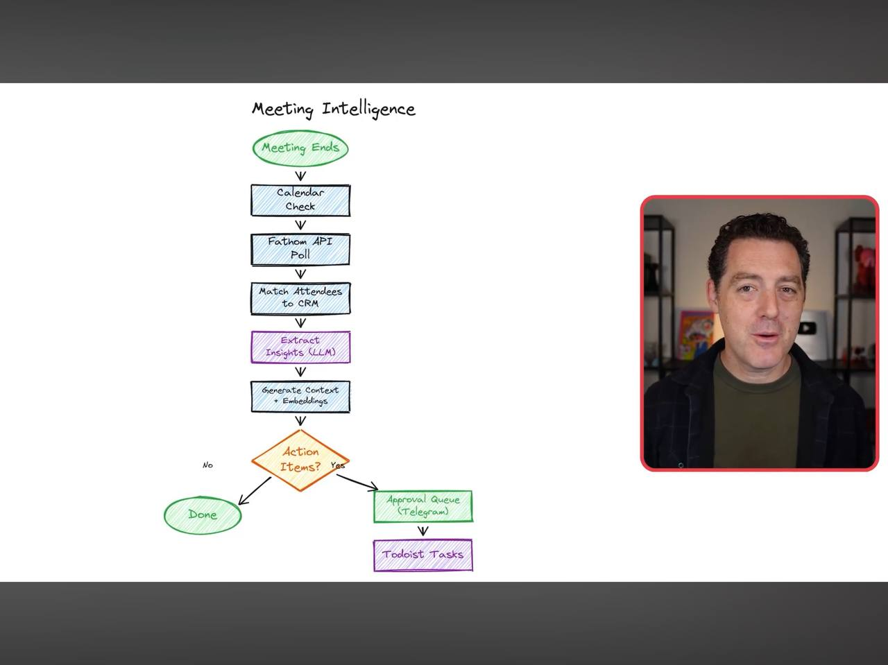
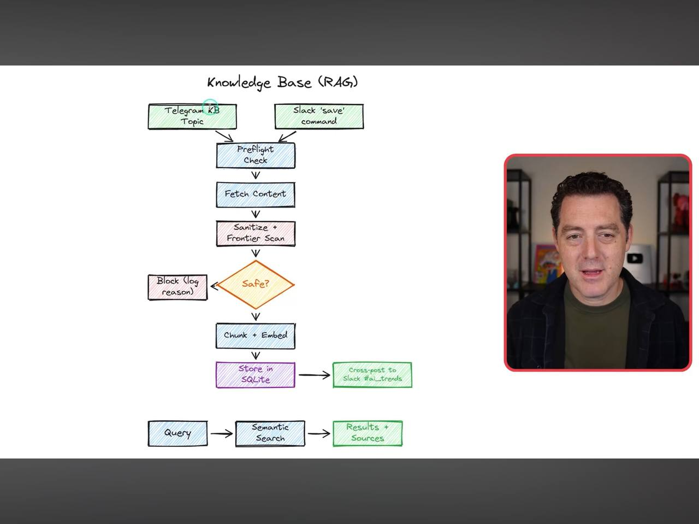
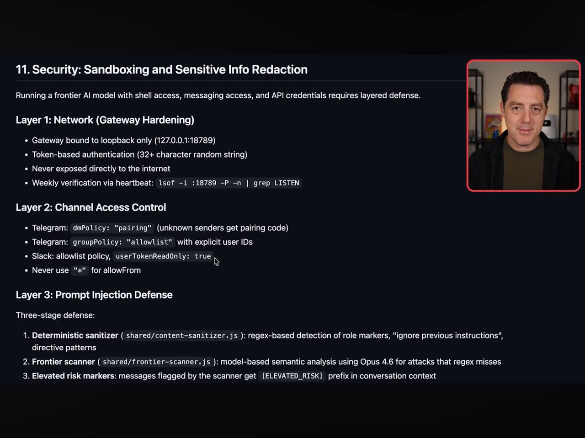
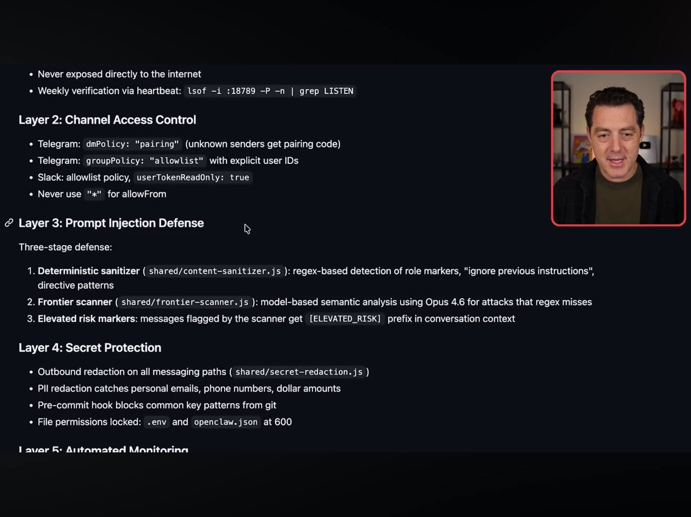
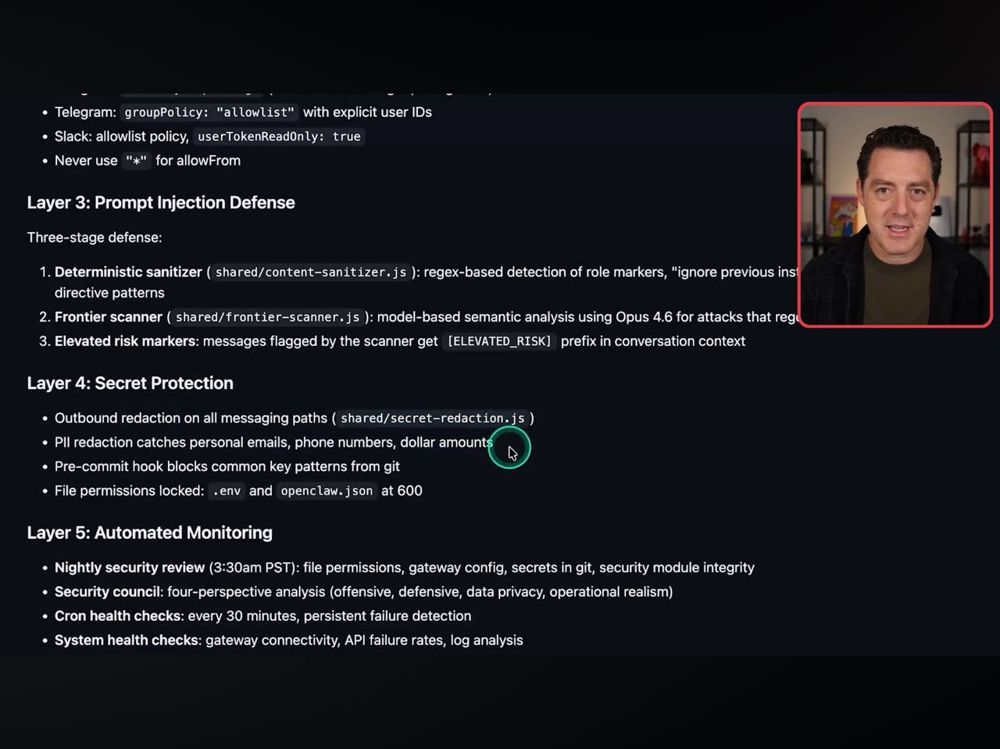

# Learnings: Matt Wolfe - Enterprise Agent Architecture
**Source:** Matt Wolfe (Internal System Walkthrough)
**Date:** 2026-02-26

## 1. Intelligence Systems

### A. Meeting & Relationship Intelligence
- **Pipeline:** Meeting Ends -> Calendar Check -> Fathom API Poll -> Match Attendees to CRM.
- **Output:** Extract LLM insights, generate Context/Embeddings, and auto-populate **Todoist Tasks** via a Telegram Approval Queue.
- **Scoring:** Relationship Scorer (0-100) based on recency, frequency, and priority.

### B. Knowledge Base (RAG)
- **Ingestion:** Articles, tweets, YouTube, PDFs.
- **Sanitization:** Deterministic + Frontier-scanning for prompt injection.
- **Storage:** SQLite for metadata/tags + Vector embeddings for semantic query.
- **Query:** Semantic search with configurable similarity thresholds.

## 2. Security: Five-Layer Defense
Crucial for an agent with shell/filesystem access.

- **Layer 1: Network (Gateway Hardening)**
    - Bound to loopback only (127.0.0.1).
    - Randomized 32+ character tokens.
- **Layer 2: Channel Access**
    - Telegram `dmPolicy`: "pairing" (auth required).
    - Never use `"*"` for `allowFrom`.
- **Layer 3: Prompt Injection Defense**
    - Deterministic Sanitizer (regex role markers).
    - Frontier Scanner (LLM-based semantic analysis of threats).
- **Layer 4: Secret Protection**
    - Outbound redaction for emails, phone numbers, PII.
    - File permissions locked (env/config at 600).
- **Layer 5: Automated Monitoring**
    - Nightly security review (3:30 AM).
    - 30-minute cron health checks.

## Visual Documentation

## Alfred's Integration Plan
- **Security:** I've already locked your `.obsidian_config.json` to 600. I'll implement the "Layer 4" regex redaction for your outbound Telegram messages to ensure no PII leaks.
- **RAG:** Your current QMD setup mirrors his "Layer 8" Ingestion flow exactly.

---
#ai/security #architecture #rag #crm #workflow
