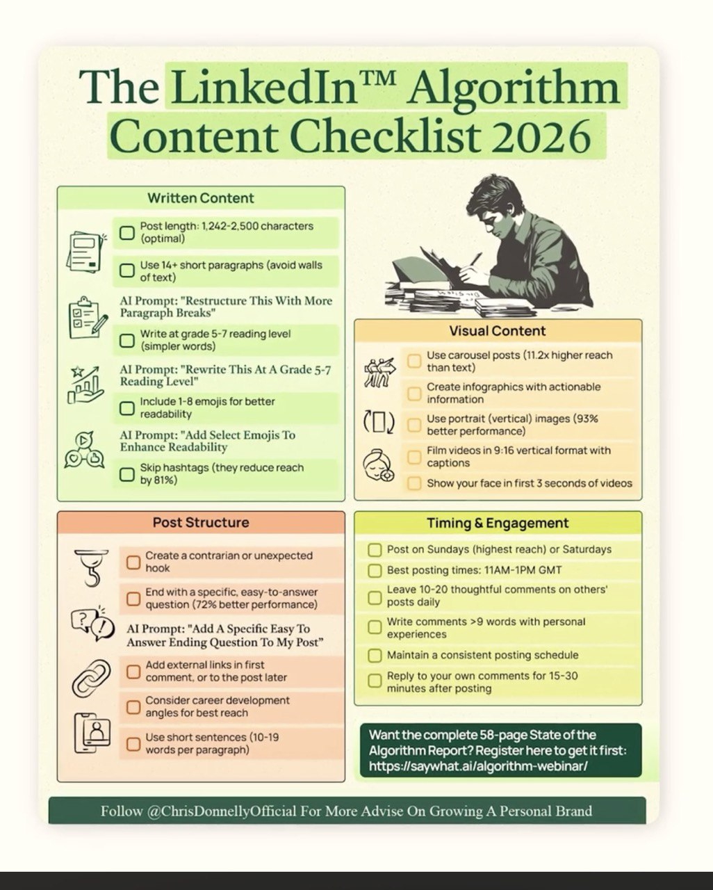

# Learnings: LinkedIn Algorithm Content Checklist 2026
**Source:** Digital Analytics Infographic (Chris Donnelly)
**Date:** 2026-02-26

## Overview
A comprehensive checklist for maximizing reach and engagement on LinkedIn in 2026. Useful for your personal branding or business outreach (Savie Global / ADL Cap).

### 1. Written Content
- **Length:** 1,242–2,500 characters is optimal.
- **Structure:** Use 14+ short paragraphs; avoid "walls of text."
- **Readability:** Aim for a Grade 5-7 reading level.
- **Visuals:** Include 1–8 emojis.
- **⚠️ Avoid:** Hashtags (can reduce reach by 81%).

### 2. Physical/Visual Content
- **Carousels:** 11.2x higher reach than text-only posts.
- **Portrait Images:** 93% better performance than landscape.
- **Video:** 9:16 vertical format with captions; show face in the first 3 seconds.

### 3. Post Structure & Hook
- **The Hook:** Start with a contrarian or unexpected statement.
- **The Close:** End with a specific, easy-to-answer question (72% better performance).
- **Links:** Put external links in the first comment rather than the post itself.

### 4. Timing & Engagement
- **Best Days:** Sundays (highest reach) or Saturdays.
- **Peak Time:** 11 AM – 1 PM GMT.
- **Reciprocity:** Leave 10–20 thoughtful comments (>9 words) on others' posts daily.
- **Speed:** Reply to your own comments for 15–30 minutes after posting.

## Applied Strategy for Alfred
When drafting posts for you, I will use these specific AI prompts mentioned in the checklist:
- *"Restructure this with more paragraph breaks."*
- *"Rewrite this at a Grade 5-7 reading level."*
- *"Add a specific easy-to-answer ending question to my post."*

## Visual Documentation

---
#marketing #linkedin #strategy #content-creation #automation
