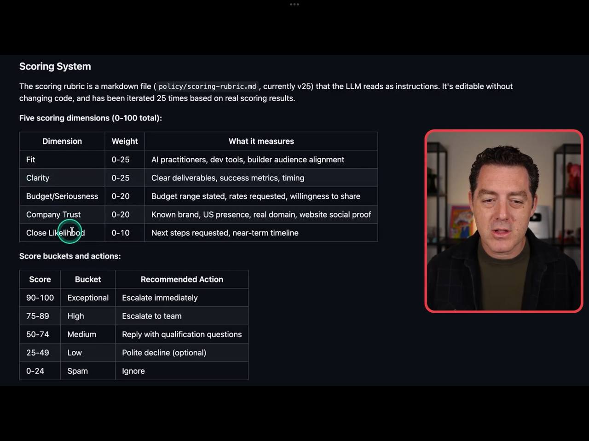
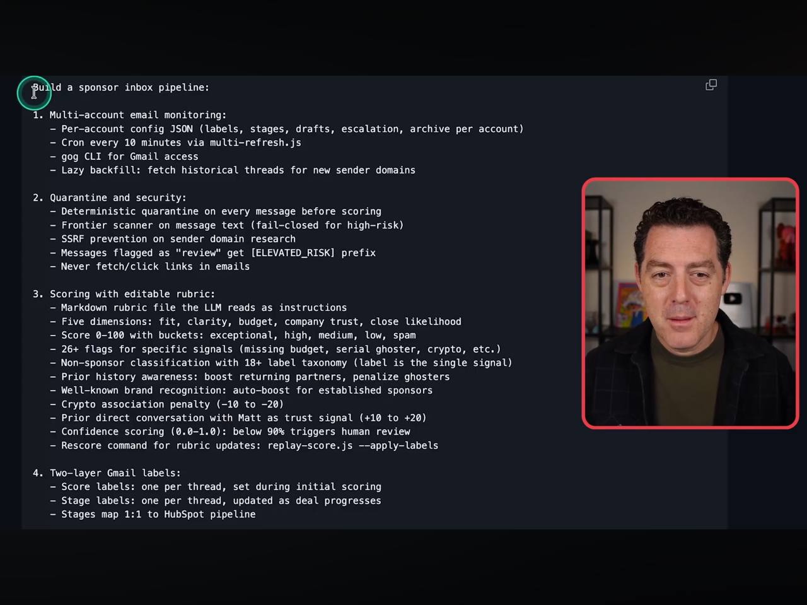
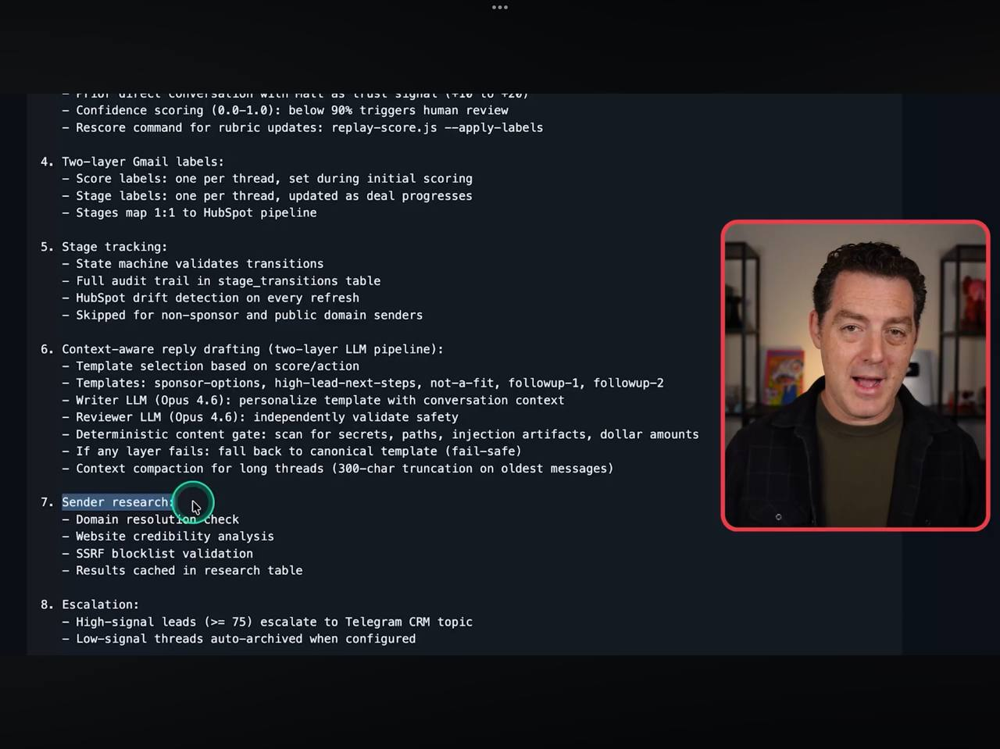
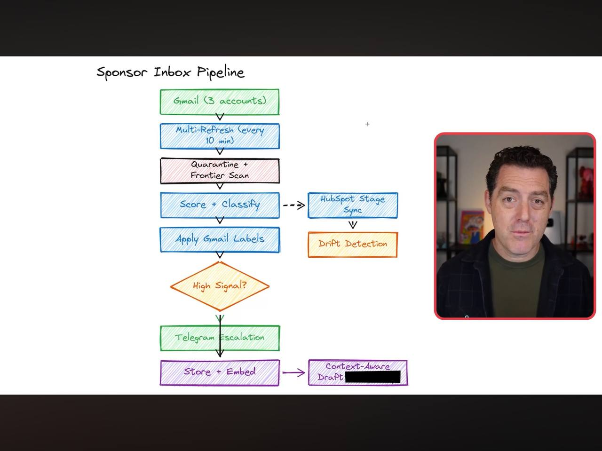

# Learnings: Matt Wolfe - Sponsor Inbox Pipeline
**Source:** [https://youtu.be/3110hx3ygp0](https://youtu.be/3110hx3ygp0)
**Date:** 2026-02-26

## Core Strategy: The "Sponsor Inbox Pipeline"
The video outlines a sophisticated AI-driven automation for managing high-volume email inboxes (specifically for sponsorships, but applicable to any lead-gen or CRM workflow).

### 1. Scoring Logic
System uses a markdown-based scoring rubric that the LLM reads as instructions.
- **Dimensions (0-100 total):** 
    - Fit (0-25)
    - Clarity (0-25)
    - Budget/Seriousness (0-20)
    - Company Trust (0-20)
    - Close Likelihood (0-10)
- **Actions based on score:**
    - 90-100: Exceptional (Escalate immediately)
    - 75-89: High (Escalate to team)
    - 50-74: Medium (Reply with qualification questions)
    - <50: Low/Spam (Decline or Ignore)

### 2. Multi-Layer Gmail Architecture
- Uses **gog CLI** (which we have!) for Gmail access.
- **Deterministic Quarantine:** Every message is scanned before scoring.
- **Two-Layer Labels:** 
    - Layer 1: Score labels (one per thread).
    - Layer 2: Stage labels (updated as deal progresses, maps 1:1 to HubSpot).

### 3. Context-Aware Replies
- Automates reply drafting based on the scoring dimension.
- Uses a **Writer LLM** to personalize templates.
- Uses a **Reviewer LLM** to validate safety and tone before sending.

### 4. Safety & Security
- Never fetch/click links in initial emails.
- Frontier scanner for high-risk text.
- SSRF prevention on sender domain research.

## Visual Documentation

## Alfred's "Aha!" Moment
This pipeline is *exactly* what we are building for your Astorica and Savie Global lead management. It uses the same tools we have: **Markdown rubrics, gog CLI, and Vector/RAG stores.**

---
#ai/automation #email #workflow #strategy
