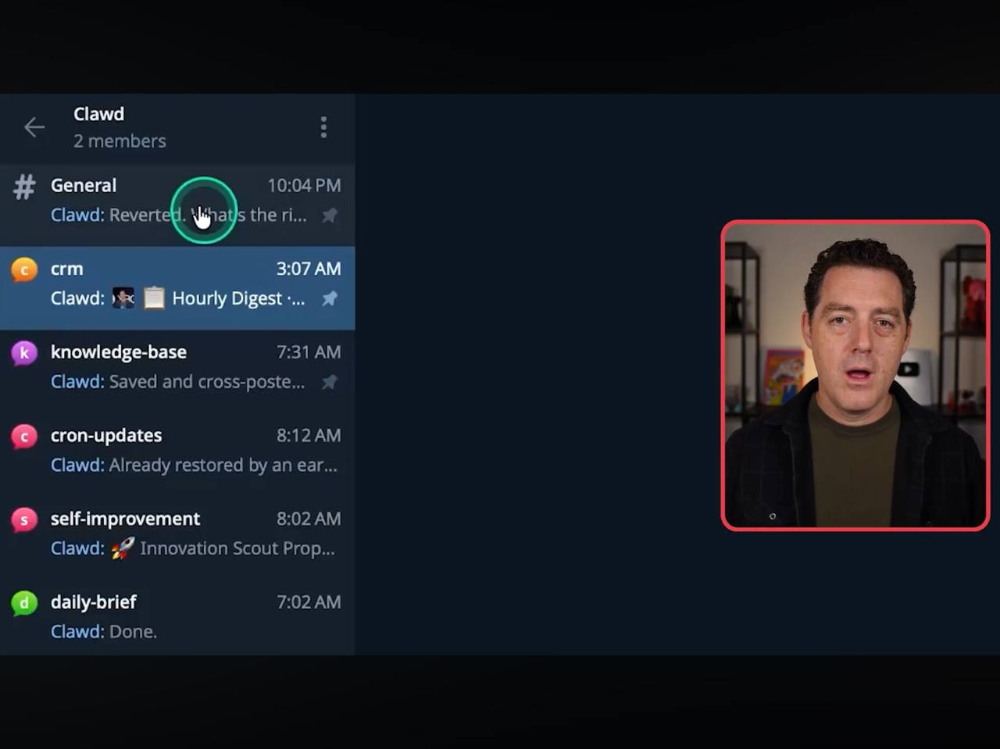
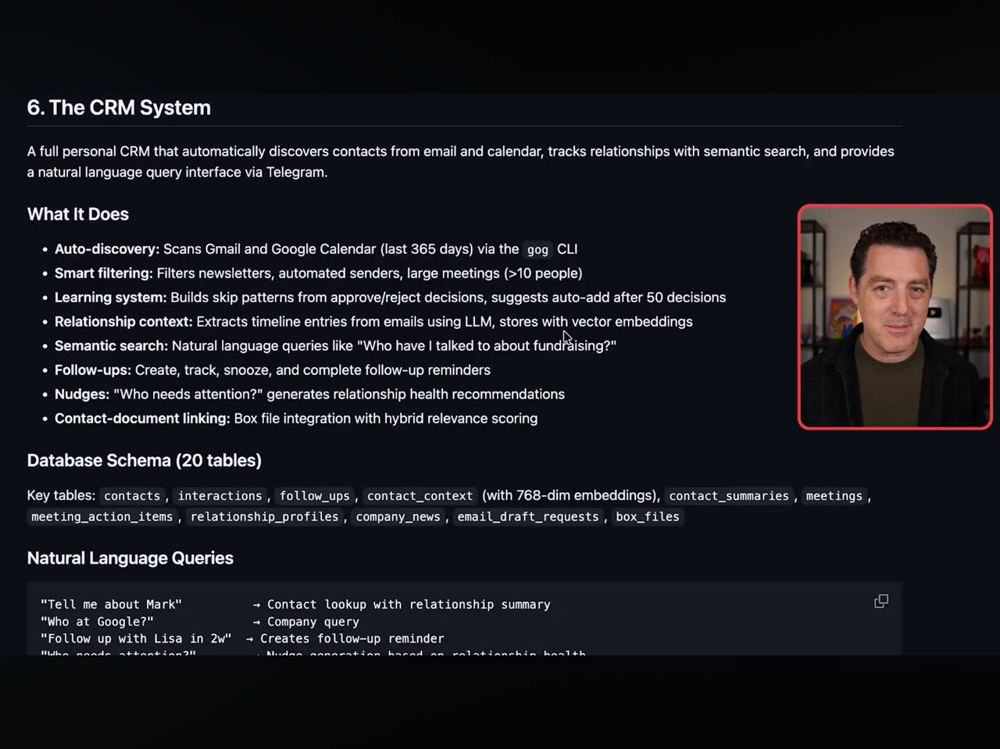
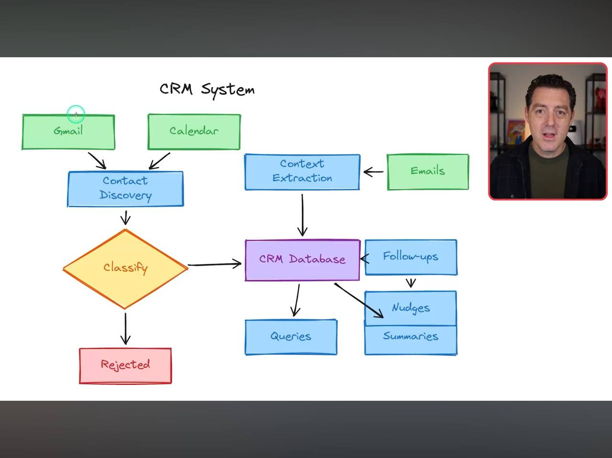

# Learnings: Matt Wolfe - Personal CRM & Telegram Topic Strategy
**Source:** Matt Wolfe (various snippets)
**Date:** 2026-02-26

## Core Concept: The Personal CRM System
Wolfe advocates for an automated personal CRM that discovers contacts, tracks relationships, and provides a natural language interface via Telegram.

### 1. Automation Pipeline
- **Auto-discovery:** Scans Gmail and Google Calendar (last 365 days) via the **gog CLI**.
- **Smart Filtering:** Filters out newsletters and large meetings (>10 people).
- **Context Extraction:** Uses LLM to extract timeline entries and relationship context from emails.
- **Storage:** Stores data with vector embeddings for semantic search.

### 2. Features & Capabilities
- **Semantic Search:** Handles queries like "Who have I talked to about fundraising?"
- **Follow-ups:** Automates creation and tracking of follow-up reminders.
- **Nudges:** Generates "who needs attention" recommendations based on relationship health.
- **Contact-Document Linking:** Integrates with local/cloud files (Box, etc.) with hybrid relevance scoring.

### 3. Telegram Topic Strategy
Uses Telegram Topics (folders/channels) to segment agent communication:
- `#general`: Daily banter and operational reverts.
- `#crm`: Hourly digests and contact alerts.
- `#knowledge-base`: Confirmation of saved/cross-posted data.
- `#cron-updates`: Status of background tasks (backups, syncs).
- `#self-improvement`: Long-term project proposals and insights.

## Visual Documentation

## Alfred's "Aha!" Moment
Your request to turn CV data into **Obsidian Contact Notes** is the first step of this exact CRM pattern. We can use our current `gog CLI` setup to start auto-discovering contacts from your `davidgnoon@gmail.com` account and linking them to those notes I just created.

---
#ai/crm #automation #telegram #knowledge-management #contacts
